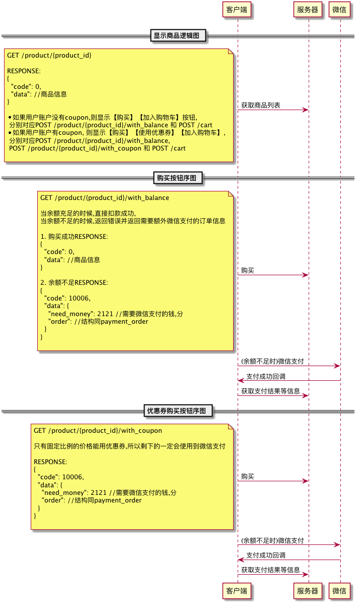

# 商品相关

## GET /products

获取商品列表

### Request Path paramater说明

| key | Requried | type | description |
|-----|----------|------|-------------|
| shop_id   | n   | number | 店铺代码，默认0 |

### Response Body说明

| key | Requried | type | description |
|-----|----------|------|-------------|
| code  | y    | number | 返回状态码 |
| data  | y     | array | 商品信息列表|

#### 商品信息

| key | Requried | type | description |
|-----|----------|------|-------------|
| id  | y    | number | 商品ID |
| name  | y     | string | 商品名称|
| description | y| string | 商品描述|
| icon | y| string | 商品图标|
| shop_id | y | number | 所属店铺ID| 
| price | y | number| 价格，单位分|
| create_at| y| string | 创建时间|
| update_at | y | string | 更新时间| 

## GET /product/{product_id}

获取单个商品

### URL paramater说明

| key | Requried | type | description |
|-----|----------|------|-------------|
| product_id   | n   | number | 商品ID |

### Response Body说明

| key | Requried | type | description |
|-----|----------|------|-------------|
| code  | y    | number | 返回状态码 |
| data  | y     | object | 商品信息， 同上|

# 购买相关

有两种购买:

1. 使用余额购买,当余额不足时调起微信支付
2. 使用优惠券购买,优惠券最高抵消40%的价格,剩下的调起微信支付

## POST /product/{product_id}/with_balance

使用余额购买单个商品

### URL paramater说明

| key | Requried | type | description |
|-----|----------|------|-------------|
| product_id   | n   | number | 商品ID |

### Response Body说明

| key | Requried | type | description |
|-----|----------|------|-------------|
| code  | y    | number | 返回状态码 |
| data  | y     | object | 商品信息， 同上|

## POST /product/{product_id}/with_coupon

使用余额购买单个商品

### URL paramater说明

| key | Requried | type | description |
|-----|----------|------|-------------|
| product_id   | n   | number | 商品ID |

### Response Body说明

| key | Requried | type | description |
|-----|----------|------|-------------|
| code  | y    | number | 返回状态码 |
| data  | y     | object | 商品信息， 同上|
